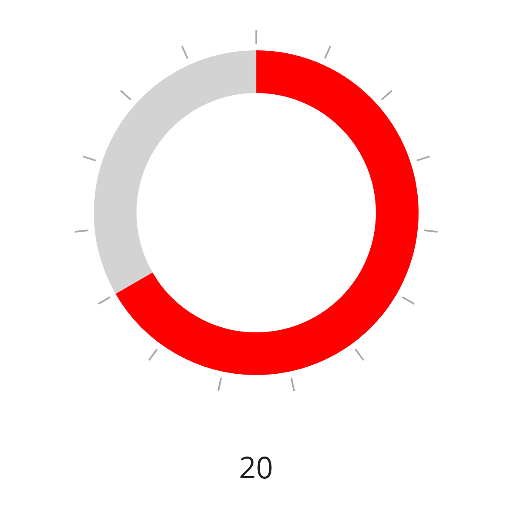
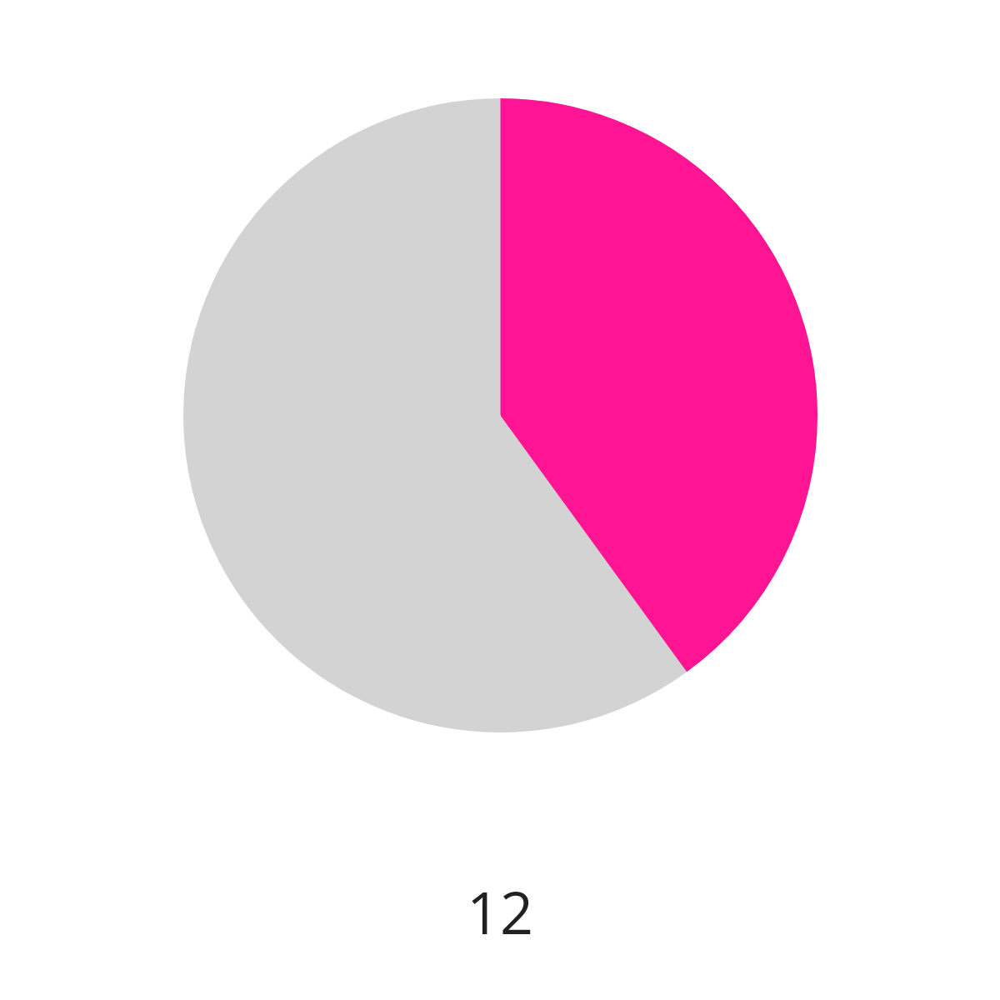
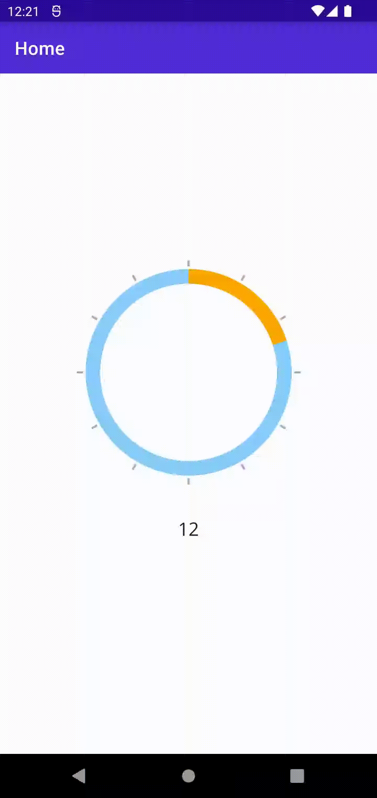

# epj.RadialDial.Maui

[](https://www.nuget.org/packages/epj.RadialDial.Maui/)

Radial Dial component for .NET MAUI

## Summary

A simple multi-purpose component that can be used as a circular dial or gauge as well as a progress ring or progress indicator. The control was developed using *SkiaSharp*.

*Note: The scale of the dial currently only shows dashes and no text labels for the scale units.*

## Platforms

Supported are **Android** and **iOS**, other platforms (incl. Windows and MacCatalyst) have not been tested, but may work anyway.

## Highlights

* Touch Input
* Snap value to full integer
* Adjustable Scale (unit labels are currently not featured yet, but the scale steps can be defined)
* Show/Hide Scale

## Preview

This is just a preview, the styling of the control can be customized. The number label is not included.
<div>
    
    
</div>
<br/>


## Usage

**Important: Register Library**

In MauiProgram.cs, add a call to *UseRadialDial()* on the builder object:

```c#
using epj.RadialDial.Maui;

namespace RadialDialSample;

public static class MauiProgram
{
    public static MauiApp CreateMauiApp()
    {
        var builder = MauiApp.CreateBuilder();
        builder
            .UseMauiApp<App>()
            .ConfigureFonts(fonts =>
            {
                fonts.AddFont("OpenSans-Regular.ttf", "OpenSansRegular");
                fonts.AddFont("OpenSans-Semibold.ttf", "OpenSansSemibold");
            })
            .UseRadialDial(); //add this

        return builder.Build();
    }
}

```

**XAML**

```xml
<?xml version="1.0" encoding="utf-8" ?>
<ContentPage xmlns="http://schemas.microsoft.com/dotnet/2021/maui"
             xmlns:x="http://schemas.microsoft.com/winfx/2009/xaml"
             xmlns:maui="clr-namespace:epj.RadialDial.Maui;assembly=epj.RadialDial.Maui"
             x:Class="RadialDialSample.MainPage">
  <VerticalStackLayout
    VerticalOptions="Center"
    Spacing="20">

    <maui:RadialDial
      TouchInputEnabled="True"
      StrokeWidth="50"
      DialColor="Orange"
      BaseColor="LightSkyBlue"
      ScaleColor="DarkGray"
      Min="0"
      Max="60"
      ShowScale="True"
      InternalPadding="10"
      ScaleDistance="10"
      ScaleLength="24"
      ScaleThickness="8"
      ScaleUnits="5"/>
    
  </VerticalStackLayout>
</ContentPage>
```

## Properties

Most of these properties are bindable for MVVM goodness. If something is missing, please open an issue.

| Type       | Property             | Description                                                             | Default Value |
|------------|----------------------|-------------------------------------------------------------------------|---------------|
| Float      | Value                | The current value of the dial (two-way bindable)                        | 10            |
| Integer    | Min                  | The minimum value of the dial                                           | 0             |
| Integer    | Max                  | The maximum value of the dial                                           | 60            |
| Float      | DialWidth            | Thickness of the Dial                                                   | 200.0         |
| Float      | InternalPadding      | Padding of the Canvas                                                   | 20.0          |
| Boolean    | TouchInputEnabled    | Enable/Disable touch events                                             | true          |
| Boolean    | SnapToNearestInteger | Uses full integer steps for *Value* when enabled                        | true          |
| Boolean    | ShowScale            | Whether or not to display the scale units                               | true          |
| Integer    | ScaleUnits           | Defines to show a scale unit for every *n* steps, e.g. every five steps | 5             |
| Float      | ScaleThickness       | Thickness of a scale unit                                               | 10.0          |
| Float      | ScaleDistance        | Offset between scale and dial                                           | 20.0          |
| Float      | ScaleLength          | Length of a scale unit                                                  | 30.0          |
| Color      | DialColor            | The main color of the dial                                              | Red           |
| Color      | BaseColor            | The color for the base of the dial                                      | LightGray     |
| Color      | ScaleColor           | The color of the scale on the dial                                      | LightGray     |

## Tips & Tricks

* Although the scale is on the outside of the dial by default, you can also draw it inside the dial by adjusting the values for *InternalPadding*, *StrokeWidth* and *ScaleDistance*

## Notes
* Uses SkiaSharp for MAUI
* Inspired by https://github.com/codechem/CC.CircularSlider.Forms
